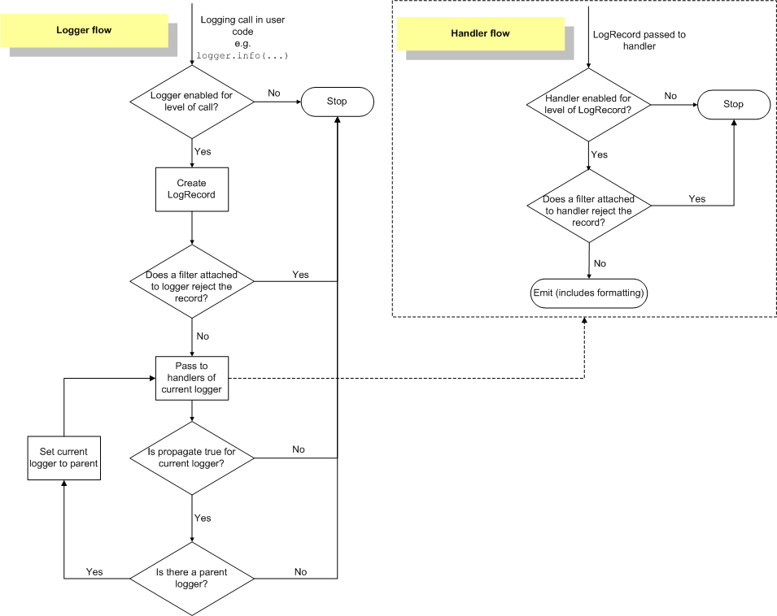

### python 日志
在结构上python日志模块由四个部分组成，分别是

1. Loggers expose the interface that application code directly uses. 
2. Handlers send the log records (created by loggers) to the appropriate destination. 
3. Filters provide a finer grained facility for determining which log records to output. 
4. Formatters specify the layout of log records in the final output. 


#### Logger
在python日志中，Logger对象有三重作用：
1. 提供接口供调用
2. 对日志进行过滤
2. 分发日志到对应的handler

于是Logger最常见的用法流程如下：
Logger.setLevel明确logger将处理的最低等级，Logger.addHandler添加handler对象，Logger.addFilter添加filter对象进行过滤

在默认情况下，logging有5个级别，分别是DEBUG，INFO，WARNING，ERROR，CRITICAL。默认的日志级别是WARNING，这也就意味着低于此级别的日志，将被忽略。

事实上，每一个日志级别都对应着一个数字型的值，具体的对应关系如下表所示。于是可以自定义日志级别。需要说明的是，如果自定义的日志级别和默认级别数字值一样，那么默认的将被覆盖。

|Level|Numeric value|
|--|---|
|CRITICAL|50| 
|ERROR|40|
|WARNING|30|
|INFO|20|
|DEBUG|10|
|NOTSET|0|


##### log函数

log函数的原型如下：
```
Logger.log(lvl, msg, *args, **kwargs) 
```
其中lvl参数用来指定日志的级别，msg参数为格式化字符串，args参数为将被格式化字符串处理的参数，kwargs参数则用来替换是logging中最初设置的Format中的参数。示例如下：
```
FORMAT = '%(asctime)-15s %(clientip)s %(user)-8s %(message)s'
logging.basicConfig(format=FORMAT)
d = {'clientip': '192.168.0.1', 'user': 'fbloggs'}
logger = logging.getLogger('tcpserver')
logger.warning('Protocol problem: %s', 'connection reset', extra=d)

#输出如下：

2006-02-08 22:20:02,165 192.168.0.1 fbloggs  Protocol problem: connection reset

```


##### Logger类说明

Logger类不是继承自object类，而是继承自Filterer类。Filterer类是Logger类和Handler类的父类，其中有三个方法，分别为filter，removeFilter，addFilter，用于对日志内容进行过滤。在Filter方法中会依次测试所有的filter。
```
    def filter(self, record):
        rv = 1
        for f in self.filters:
            if not f.filter(record):
                rv = 0
                break
        return rv
```

在Logger类中最主要的字段，包括propagate，parent，handlers，name，level，以及disabled。

在调用Logger类的error、info等方法时，首先会调用isEnabledFor方法检查当前的level是否大于预先设置的level。然后会调用Logger._logger方法对日志信息进行处理。
```
    def info(self, msg, *args, **kwargs):
        if self.isEnabledFor(INFO):
            self._log(INFO, msg, args, **kwargs)
```
在_log方法中，首先会调用findcaller方法，然后会调用makeRecord方法，将待处理的日志信息，组装成LogRecord，最后调用handler方法进行处理。
```
    def _log(self, level, msg, args, exc_info=None, extra=None):
        """
        Low-level logging routine which creates a LogRecord and then calls
        all the handlers of this logger to handle the record.
        """
        if _srcfile:
            #IronPython doesn't track Python frames, so findCaller raises an
            #exception on some versions of IronPython. We trap it here so that
            #IronPython can use logging.
            try:
                fn, lno, func = self.findCaller()
            except ValueError:
                fn, lno, func = "(unknown file)", 0, "(unknown function)"
        else:
            fn, lno, func = "(unknown file)", 0, "(unknown function)"
        if exc_info:
            if not isinstance(exc_info, tuple):
                exc_info = sys.exc_info()
        record = self.makeRecord(self.name, level, fn, lno, msg, args, exc_info, func, extra)
        self.handle(record)
```
在handle方法中，会先检查是否通过filter以及当前logger是否为disabled。然后调用callHandler是对记录进行处理。

```
    def handle(self, record):
        if (not self.disabled) and self.filter(record):
            self.callHandlers(record)
```
在callHandlers方法中，会将日志记录分发到与当前logger关联的所有handler中，同时检查record的level是否大于handler的level，如果大于等于才会分发。然后会检查propagate是否为true，如果为true则会在parent logger中继续分发。
```

    def callHandlers(self, record):
        """
        Pass a record to all relevant handlers.

        Loop through all handlers for this logger and its parents in the
        logger hierarchy. If no handler was found, output a one-off error
        message to sys.stderr. Stop searching up the hierarchy whenever a
        logger with the "propagate" attribute set to zero is found - that
        will be the last logger whose handlers are called.
        """
        c = self
        found = 0
        while c:
            for hdlr in c.handlers:
                found = found + 1
                if record.levelno >= hdlr.level:
                    hdlr.handle(record)
            if not c.propagate:
                c = None    #break out
            else:
                c = c.parent
        if (found == 0) and raiseExceptions and not self.manager.emittedNoHandlerWarning:
            sys.stderr.write("No handlers could be found for logger"
                             " \"%s\"\n" % self.name)
            self.manager.emittedNoHandlerWarning = 1
```

##### 日志的配置
logger的配置可以在代码中完成，也可以使用配置文件进行配置。例如
```
[loggers]
keys=root,simpleExample

[handlers]
keys=consoleHandler

[formatters]
keys=simpleFormatter

[logger_root]
level=DEBUG
handlers=consoleHandler

[logger_simpleExample]
level=DEBUG
handlers=consoleHandler
qualname=simpleExample
propagate=0

[handler_consoleHandler]
class=StreamHandler
level=DEBUG
formatter=simpleFormatter
args=(sys.stdout,)

[formatter_simpleFormatter]
format=%(asctime)s - %(name)s - %(levelname)s - %(message)s
```
在具体使用时，可以使用`logging.config.fileConfig('logging.conf')`来加载指定文件中的配置。

#### Handler

在logger对象将日志分发到Handler对象之后，就由handler对象对日志进行处理。

具体的处理流程如下：

在handler类的handle方法中，首先会调用filter方法对record进行过滤。如果结果为True，那么先调用self.acquire方法获取锁，然后，调用emit方法写入记录，最后调用release方法释放锁。需要注意的是在如果在emit方法中出现异常，那么并不会重试，而是直接忽略。
```
        rv = self.filter(record)
        if rv:
            self.acquire()
            try:
                self.emit(record)
            finally:
                self.release()
        return rv
```


在logging.handler类中，对emit方法并没有实现，而是强制要求子类进行实现。一般而言，在子类的的emit方法中，首先会调用format对record进行格式化（一个handler只能关联一个formatter），然后对日志进行写入。

除了最基本的Handler，python中还提供了StreamHandler，FileHandler，MemoryHandler, RotatingFileHandler，SocketHandler，Nullhandler等。

一般而言，在自定义Handler时，需要重写__init__方法，flush方法，emit方法以及close方法。

##### RotatingFileHandler

##### TimedRotatingFileHandler 

#### Filter

Filter类相对比较简单，只有一个方法，filter用来对record进行过滤。

#### Formatter

Formatter类也相对比较简单，其中最重要的方法是format方法，用来对record进行格式化。具体的可选格式化参数如下：
```
    %(name)s            Name of the logger (logging channel)
    %(levelno)s         Numeric logging level for the message (DEBUG, INFO,
                        WARNING, ERROR, CRITICAL)
    %(levelname)s       Text logging level for the message ("DEBUG", "INFO",
                        "WARNING", "ERROR", "CRITICAL")
    %(pathname)s        Full pathname of the source file where the logging
                        call was issued (if available)
    %(filename)s        Filename portion of pathname
    %(module)s          Module (name portion of filename)
    %(lineno)d          Source line number where the logging call was issued
                        (if available)
    %(funcName)s        Function name
    %(created)f         Time when the LogRecord was created (time.time()
                        return value)
    %(asctime)s         Textual time when the LogRecord was created
    %(msecs)d           Millisecond portion of the creation time
    %(relativeCreated)d Time in milliseconds when the LogRecord was created,
                        relative to the time the logging module was loaded
                        (typically at application startup time)
    %(thread)d          Thread ID (if available)
    %(threadName)s      Thread name (if available)
    %(process)d         Process ID (if available)
    %(message)s         The result of record.getMessage(), computed just as
                        the record is emitted
```


#### LogRecord


#### 使用时需要注意的事项

1. 可以使用logger.isEnabledFor(logging.DEBUG)函数来检测当前的日志系统是否支持对应日志级别。这样就可以尽可能减少开销。
```
if logger.isEnabledFor(logging.DEBUG):
    logger.debug('Message with %s, %s', expensive_func1(),
                                        expensive_func2())
```


### FAQ

1. logger的level和handler的level关系如何？
答：可以看做与关系，待处理的日志的level必须大于logger的level和handler的level才能被handler处理。
2. logger，handler，formatter，filter之间的关系？
答：一个logger可以有多个handler，多个filter。一个handler中又可以有多个filter，但是一个handler只能有一个formatter。filter和formatter之间并没有直接的联系。