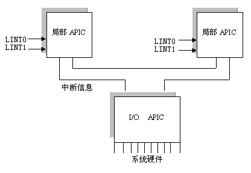

## 中断

中断子系统是linux系统中的重要组成部分。可以通过`/proc/interrupts`查询当前Linux系统中注册的中断信息。例如一台虚拟机的中断信息如下所示，从左到右，每一列分别是irq编号，每个cpu对该irq的处理次数，中断控制器的名字，irq的名字，以及驱动程序注册该irq时使用的名字

```
           CPU0       CPU1       CPU2       CPU3       CPU4       CPU5       CPU6       CPU7
  0:         18          0          0          0          0          0          0          0   IO-APIC-edge      timer
  1:         10          0          0          0          0          0          0          0   IO-APIC-edge      i8042
  4:        440          0          0          0          0          0          0          0   IO-APIC-edge      serial
  8:          0          0          0          0          0          0          0          0   IO-APIC-edge      rtc0
  9:          0          0          0          0          0          0          0          0   IO-APIC-fasteoi   acpi
 11:          0          0          0          0          0          0          0          0   IO-APIC-fasteoi   uhci_hcd:usb1, virtio3
 14:   11660809          0          0          0          0          0          0          0   IO-APIC-edge      ata_piix
 15:          0          0          0          0          0          0          0          0   IO-APIC-edge      ata_piix
 40:          0          0          0          0          0          0          0          0   PCI-MSI-edge      virtio1-config
 41:   25034454          0          0          0          0          0          0          0   PCI-MSI-edge      virtio1-requests
 42:          0          0          0          0          0          0          0          0   PCI-MSI-edge      virtio2-config
 43:   11033757          0          0          0          0          0          0          0   PCI-MSI-edge      virtio2-requests
 44:          2          0          0          0          0          0          0          0   PCI-MSI-edge      virtio0-config
 45:  169928633          0          0          0          0          0          0          0   PCI-MSI-edge      virtio0-input.0
 46:          1          0          0          0          0          0          0          0   PCI-MSI-edge      virtio0-output.0
 47:          2  176157613          0          0          0          0          0          0   PCI-MSI-edge      virtio0-input.1
 48:          1          0          0          0          0          0          0          0   PCI-MSI-edge      virtio0-output.1
NMI:          0          0          0          0          0          0          0          0   Non-maskable interrupts
LOC: 1958132589 1657849915 1464302461 1412969718 1410404958 1414136083 1429197016 1418969785   Local timer interrupts
SPU:          0          0          0          0          0          0          0          0   Spurious interrupts
PMI:          0          0          0          0          0          0          0          0   Performance monitoring interrupts
IWI:   17320705   14373249   12736401   12565115   12658244   12767974   12794411   12401764   IRQ work interrupts
RTR:          0          0          0          0          0          0          0          0   APIC ICR read retries
RES:  155359213  149014802  142369862  139527282  137486128  139711008  134586050  134915605   Rescheduling interrupts
CAL:   22274951   22199401   42494792   42222384   41877678   44018113   42100488   43280494   Function call interrupts
TLB:   15098718   16048806   16259641   16152688   16129800   16013566   16185393   15931556   TLB shootdowns
TRM:          0          0          0          0          0          0          0          0   Thermal event interrupts
THR:          0          0          0          0          0          0          0          0   Threshold APIC interrupts
DFR:          0          0          0          0          0          0          0          0   Deferred Error APIC interrupts
MCE:          0          0          0          0          0          0          0          0   Machine check exceptions
MCP:      39802      39802      39802      39802      39802      39802      39802      39802   Machine check polls
ERR:          0
MIS:          0
```

**注意**

在上例中，可以看到有些irq的名字以edge结尾，有些以level结尾。一般情况下，以edge结尾表示边沿触发，以level结尾表示水平触发。

linux系统中还会有一个`/proc/irq`目录，该目录下面会为每个注册的irq创建一个以irq编号为名字的子目录，每个子目录下分别有以下文件（具体可能根据linux版本不同而不同，但以下三个文件是一定有的）：

1. smp_affinity irq和cpu之间的亲和性绑定，bitmask表示，为1表示该中断可以被对应编号的CPU处理。
1. smp_affinity_list irq和cpu之间的亲和性绑定，cpu list 表示。`smp_affinity_list`和`smp_affinity` 是等价的。例如`smp_affinity_list`值为`0-2,5,7`时`smp_affinity`值为`a7`。在需要时，可以任意选择其中之一变更亲和性绑定。
1. spurious 可以获得该irq被处理和未被处理的次数
1. smp_affinity_hint 含义不明

> https://lwn.net/Articles/44139/
> https://www.ibm.com/developerworks/cn/linux/l-cn-linuxkernelint/index.html


### 中断控制器

#### 高级可编程中断控制器（APIC）



I/O APIC 由一组 24 条 IRQ 线，一张 24 项的中断重定向表（Interrupt Redirection Table），可编程寄存器，以及通过 APIC 总线发送和接收 APIC 信息的一个信息单元组成。其中与中断亲和力息息相关的是中断重定向表，中断重定向表表中的每一项都可以被单独编程以指明中断向量和优先级、目标处理器及选择处理器的方式。

在系统初始化期间，对于 SMP 体系结构，将会调用 `setup_IO_APIC_irqs()` 函数来初始化 I/O APIC 芯片，芯片中的中断重定向表的 24 项被填充。在系统启动期间，所有的 CPU 都执行 `setup_local_APIC()` 函数，完成本地的 APIC 初始化。当有中断被触发时，将相应的中断重定向表中的值转换成一条消息，然后，通过 APIC 总线把消息发送给一个或多个本地 APIC 单元，这样，中断就能立即被传递给一个特定的 CPU，或一组 CPU，或所有的 CPU，从而来实现中断亲和力。

### 中断分类

**按照产生方式**

1. 同步中断是当指令执行时由 CPU 控制单元主动产生，之所以称为同步，是因为只有在一条指令执行完毕后 CPU 才会发出中断，而不是发生在代码指令执行期间，比如系统调用。同步中断又称为异常（exception）。异常可分为故障（fault）、陷阱（trap）、终止（abort）三类。
2. 异步中断是指由其他硬件设备依照 CPU 时钟信号随机产生，即意味着中断能够在指令之间发生，例如键盘中断。异步中断又被称为中断（interrupt）。

**按照是否可屏蔽**

中断可分为可屏蔽中断（Maskable interrupt）和不可屏蔽中断。

1. 可屏蔽中断（Maskable interrupts）这些中断是可以被CPU忽略或延迟处理的。当缓存控制器的外部针脚被触发的时候就会产生这种类型的中断，而中断屏蔽寄存器就会将这样的中断屏蔽掉。我们可以将一个比特位设置为0，来禁用在此针脚触发的中断。
2. 不可屏蔽中断（Non-maskable interrupts,即NMI）就像这种中断类型的字面意思一样，这种中断是不可能被CPU忽略或取消的。NMI是在单独的中断线路上进行发送的，它通常被用于关键性硬件发生的错误，如内存错误，风扇故障，温度传感器故障等。


### Linux 中断

Linux 中常见的中断包括以下几种

1. 时钟中断。时钟芯片产生，主要工作是处理和时间有关的所有信息，决定是否执行调度程序以及处理下半部分。和时间有关的所有信息包括系统时间、进程的时间片、延时、使用CPU的时间、各种定时器，进程更新后的时间片为进程调度提供依据，然后在时钟中断返回时决定是否要执行调度程序。
2. NMI中断。外部硬件通过CPU的 NMI Pin 去触发（硬件触发），或者软件向CPU系统总线上投递一个NMI类型中断（软件触发），NMI中断的主要用途包括，告知操作系统有硬件错误（Hardware Failure），如内存错误，风扇故障，温度传感器故障等，用来做看门狗定时器，检测CPU死锁等；
3. 硬件IO中断。包括大多数硬件外设IO中断，比如网卡，键盘，硬盘，鼠标，USB，串口等；
4. 虚拟中断。KVM里面一些中断退出和中断注入等，软件模拟中断。例如上文中从`/proc/interrupts`得到的virtio0中断。

#### Linux 中断处理

由于中断会打断内核中进程的正常调度运行，所以要求中断服务程序尽可能的短小精悍；但是在实际系统中，当中断到来时，要完成工作往往需要进行大量的耗时处理。因此期望让中断处理程序运行得快，并想让它完成的工作量多，这两个目标相互制约，诞生顶/底半部机制。

**中断上半部分**

中断处理程序是顶半部——接受中断，它就立即开始执行，但只有做严格时限的工作。能够被允许稍后完成的工作会推迟到底半部去，此后，在合适的时机，底半部会被开终端执行。顶半部简单快速，执行时禁止部分或者全部中断。

**中断下半部分**

底半部稍后执行，而且执行期间可以响应所有的中断。这种设计可以使系统处于中断屏蔽状态的时间尽可能的短，以此来提高系统的响应能力。顶半部只有中断处理程序机制，而底半部的实现有软中断，tasklet和工作队列等实现方式；

 

