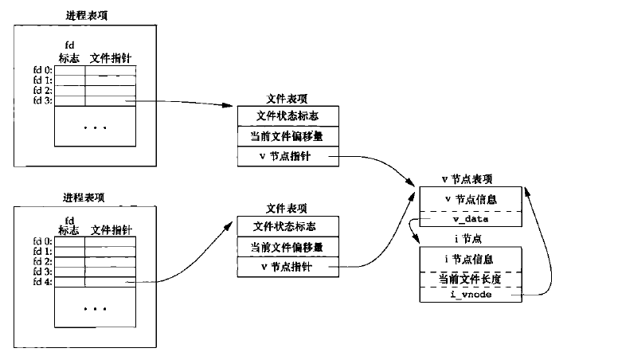

## I/O

### 文件I/O

对于linux内核而言，所有打开的文件都通过文件描述符引用。事实上，由于在linux中一切皆文件，所以，可以用文件I/O来操作socket等。

### open

```
#include<fcntl.h>
int open(const char *pathname, int oflag, ... /* mode_t mode */)
//若出错返回-1
```

open 函数里的关键是第二个参数和第三个参数。第二个参数是指该文件的打开模式。常用的模式包括以下几种

1. O_RDWR 读写打开
2. O_RDONLY 只读打开
3. O_WRONLY 只写打开
4. O_APPEND 追加模式
5. O_CREAT  若不存在，则床架
6. O_EXECL 如果同时指定了O_CREAT参数，而文件存在则会出错。可以用来原子的检查一个文件是够存在，如果不存在则创建它。
7. O_TRUNC 如果文件存在，而且为只写或读写打开，则将文件的长度阶段为0
8. O_NONBLOCK 将本次打开以及后续操作设置为非阻塞模式。
9. O_SYNC，O_DSYNC,O_RSYNC 这三个位比较复杂，一般而言，O_SYNC保证每次write都等到物理I/O完成之后，才返回。剩余两个位在一般实现下功能与O_SYNC相同。

mode 则是指定了在O_CREAT模式下，对文件权限位的修改。mode还会受到umask的限制，例如umask为002，mode为777，那么最终创建完成后得到的文件的权限就是775。

最后，需要说明的是，open返回文件描述符一定是最小的未用描述符。于是就可以在标准输入，标准输出以及错误输出上打开新的文件。

### create

```
#include<fcntl.h>
int creat(const char *pathname,  mode_t mode)
```

creat函数相对比较简单，本质上可以看做是open函数的封装

### close

```
int close(int filedes);
//成功返回0，出错返回-1
```

### lseek

```
off_t lseek(int fd, off_t offset, int whence);
//成功返回新的文件偏移量，出错返回-1
```
其中whence可以是：
* SEEK_SET 文件开始处，offset不能为负值
* SEEK_CUR 当前位置，offset可正可负
* SEEK_END 文件结尾，offser可正可负

### read

```
ssize_t read(int fd, void *buf, size_t nbytes);
```
如果成功返回读到的字节数，如果已经到文件尾，返回0， 如果出错，返回-1.
### write

```
ssize_t write(int fd, void *buf, size_t nbytes);
```
如果成功返回已写的字节数, 如果出错，返回-1.

### pread 和 pwrite
```
#include<unistd.h>
ssize_t write(int fd, void *buf, size_t nbytes);
//如果成功返回读到的字节数，如果已经到文件尾，返回0， 如果出错，返回-1.
ssize_t read(int fd, void *buf, size_t nbytes);
//如果成功返回已写的字节数, 如果出错，返回-1.
```
pread和pwrite相当于先调用lseek，然后调用read/write。但是有以下区别：
* pread/pwrite 相当于是原子操作，在执行时，无法中断其定位和读操作
* 不更新当前文件偏移量

### dup
```
int dup(int fild);
int dup2(int fd, int fd2)
//如成功，返回新的描述符，若出错，返回-1
```
dup函数返回的新文件描述符是当前可用文件描述符中最小数值。对于dup2，如果，fd2已经打开，那么会将其关闭。同时如果，fd等于fd2，那么dup2返回fd2，而不关闭。

复制完成后的，两个文件描述符指向了同一个文件表项。于是使用fd调用write就相当于使用fd2调用write.

事实上，调用dup相当于调用fcntl。不过dup是一个原子操作。

### sync

```
#include<unisted.h>

int fsync(int fd)
int fdatasync(int fd);
// 成功返回0，出错返回-1
void sync(void);
```
sync会将所有修改过的块缓冲写入队列，然后就返回，但是并不等待实际写操作结束。

通常，称为update的系统守护进程周期性地调用sync函数。这就保证了定期冲洗内核的块缓冲区。

命令行命令sync就是调用了sync函数。

fsync函数只对由文件描述符fd指定的一个文件起作用，并且等待写操作结束才返回，可以保证修改过的块立即写到磁盘上呢。

fdatasync函数类似于fsync，但是只影响数据部分。fsync还会同步文件属性。

一般而言执行同步写之后，程序运行的时钟时间会大大增加。

### fcntl

fcntl函数可以改变打开文件的属性。

```
#include<fcntl.h>

int fcntl(int fd, int cmd, ... /* int arg */);
//若出错，返回-1
```

fcntl 函数是一个很复杂的函数，主要功能包括五个方面：
1. 复制一个现有的描述符（cmd = F_DUPFD）
2. 获取/设置文件描述符标记（cmd = F_GETFD 或 F_SETFD）
3. 获取/设置文件状态标记（cmd = F_GETFL 或 F_SETFL）
4. 获取/设置异步I/O所有权（cmd = F_GETOWN 或 F_SETOWN）
5. 获取/设置记录锁（cmd = F_GETLK 或 F_SETLK或F_SETLKW）

### ioctl

```
#include<unistd.h>
#include<sys/ioctl.h>

int ioctl(int fd, int request, ...)
```

ioctl的用法相对复杂，主要用于终端I/O

### 文件共享

1. 每个进程在进程表中都有一个记录项，记录项中包含一张打开文件描述符表，每个描述符占用一项。与每个文件描述关联的项包括：
 * 文件描述符标识
 * 指向一个打开文件表项的指针
2. 内核为所有打开的文件维持一张文件表，每个文件表包括：
 * 文件描述符标识
 * 当前文件的偏移量
 * 指向文件v节点表项的指针
3. 每个打开的文件都有一个v-node，v-node中包含了文件类型和对此文件进行各种操作函数的指针。对于大多数文件，v-node还包含了i-node。i-node则包含了文件的所有点，文件长度，文件实际位置等信息。事实上，在linux中没有v-node，只有i-node

当两个进程各自打开同一个文件时，关系如下图所示。

在这种情况下，如果两个进程在同一个偏移量写入数据，那么后写入的数据会覆盖先写入的数据。

### /dev/fd

在/dev/fd目录下包含了当前进程打开的文件描述符，这也就意味着使用不同的进程去读取这个目录，会得到不同的结果。

例如如果直接使用`ls -l /dev/fd/`那么会看到4个文件描述符，分别是0,1,2,3 其中3就是由ls打开的指向/dev/fd目录的文件描述符

### 标准I/O

### 高级I/O

#### 非阻塞

```
fcntl(fd, F_SETFL, O_NONBLOCK);
```

#### 记录锁

在linux中可以对一个文件的一个区域加锁，来确保只有一个进程在读写这个文件。

对文件设计记录锁，同样采用fcntl函数，只不过第二个cmd参数的值为F_GETLK，F_SETLK或F_SETLKW。第三个参数为指向flock结构的指针。

这里需要说明的是，F_GETLK可以获得在指定区域的锁，F_SETLK则尝试在在指定区域加锁，如果失败，那么fcntl会立即出错返回。F_SETLKW则是F_SETLK的阻塞版本，如果所请求的锁因另一个进程的原因，不能马上获取，那么该调用进程会等待，直到获取对应的锁。

另外需要说明的是，系统会对锁进行拆分和合并。例如100~149,151~199两把锁会在获取150这把锁后，三个锁合并为一个锁。

进程结束时，或者文件描述符关闭时，与之关联的锁都会释放（该进程设置的锁）。于是下面的情况锁会被释放

```
```

**小练习：锁的获取与释放**


#### I/O 多路转换