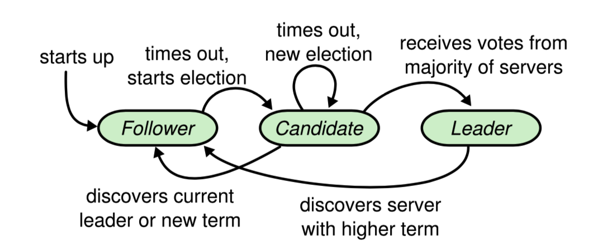
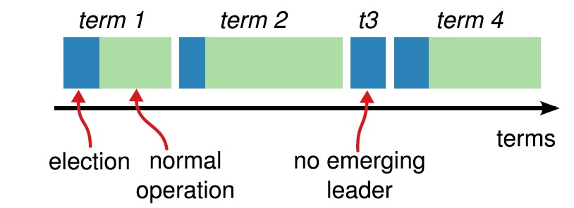

### RAFT 协议

**复制状态机**

应用于实际系统的一致性算法一般有以下特征:

1. 安全性，即从来不会返回错误的结果。
2. 高可用性，只要集群中的大部分机器能运行，可以互相通信并且可以和客户端通信，这个集群就可用。
3. 不依赖时序保证一致性，时钟错误和极端情况下的消息延迟在最坏的情况下才会引起可用性问题。
4. 通常情况下，一条命令能够尽可能快的在大多数节点做出响应时完成，一部分慢的机器不会影响系统的整体性能。

RAFT 协议可以看做三两部分组成:

1. Leader Election
2. Log Replication
3. Safety

#### State

raft 协议会在各个节点上保存状态信息，状态信息根据节点role的不同，保存类型的不同会包括以下内容。

**Persistent state on all servers（持久化保存在所有节点上）**

|名称|描述|
|---|---|
|currentTerm|服务器最后知道的任期号（从 0 开始递增）|
|votedFor|在当前任期内收到选票的候选人 id（如果没有就为 null）|
|log[]|日志条目；每个条目包含状态机的要执行命令和从领导人处收到时的任期号|

**Volatile state on all servers**

|名称|描述|
|---|---|
|commitIndex|已知的被提交的最大日志条目的索引值（从 0 开始递增）|
|lastApplied|被状态机执行的最大日志条目的索引值（从 0 开始递增）|

**Volatile state on leaders**

|名称|描述|
|---|---|
|nextIndex[]|对于每一个服务器，记录需要发给它的下一个日志条目的索引（初始化为领导人上一条日志的索引值 +1）|
|matchIndex[]|对于每一个服务器，记录已经复制到该服务器的日志的最高索引值（从 0 开始递增）|

#### AppendEntries RPC

AppendEntries RPC 是Raft协议中，最基本的两个RPC调用之一。在Log Replication 过程中，由leader请求follower。

**Arguments**

|名称|描述|
|---|---|
|term|领导人的任期号|
|leaderId|领导人的 id，为了其他服务器能重定向到客户端|
|prevLogIndex|最新日志之前的日志的索引值|
|prevLogTerm | 最新日志之前的日志的Term|
|entries[]| 将要存储的日志条目（表示 heartbeat 时为空，有时会为了效率发送超过一条）|
|leaderCommit|领导人提交的日志条目索引值|

**Results**

|名称|描述|
|---|---|
|term|当前的任期号，用于领导人更新自己的任期号|
|success|如果其它服务器包含能够匹配上 prevLogIndex 和 prevLogTerm 的日志时为真|

**接收者需要实现**

1. 如果 term < currentTerm返回 false
2. 如果在prevLogIndex处的日志的任期号与prevLogTerm不匹配时，返回 false
3. 如果一条已经存在的日志与新的冲突（index 相同但是任期号 term 不同），则删除已经存在的日志和它之后所有的日志
4. 添加任何在已有的日志中不存在的条目
5. 如果leaderCommit > commitIndex，将commitIndex设置为leaderCommit和最新日志条目索引号中较小的一个

#### RequestVote RPC

**Arguments**

|名称|描述|
|---|----|
|term | 候选人的任期号|
|candidateId|	请求投票的候选人 id |
|lastLogIndex| 候选人最新日志条目的索引值 |
|lastLogTerm| 候选人最新日志条目对应的任期号 |

**Results**

|名称|描述|
|---|----|
|term|	目前的任期号，用于候选人更新自己|
|voteGranted|	如果候选人收到选票为 true|

**接收者需要实现**

1. 如果term < currentTerm返回 false
2. 如果votedFor为空或者与candidateId相同，并且候选人的日志和自己的日志一样新，则给该候选人投票

#### 所有节点需要遵守的规则

**所有节点**

1. 如果commitIndex > lastApplied，lastApplied自增，将log[lastApplied]应用到状态机
2. 如果 RPC 的请求或者响应中包含一个 term T 大于 currentTerm，则currentTerm赋值为 T，并切换状态为追随者（Follower）

**Follower**

响应来自候选人和领导人的 RPC
如果在超过选取领导人时间之前没有收到来自当前领导人的AppendEntries RPC或者没有收到候选人的投票请求，则自己转换状态为候选人

**候选人**

转变为选举人之后开始选举：
currentTerm自增
给自己投票
重置选举计时器
向其他服务器发送RequestVote RPC
如果收到了来自大多数服务器的投票：成为领导人
如果收到了来自新领导人的AppendEntries RPC（heartbeat）：转换状态为追随者
如果选举超时：开始新一轮的选举
领导人：

一旦成为领导人：向其他所有服务器发送空的AppendEntries RPC（heartbeat）; 在空闲时间重复发送以防止选举超时（5.2 节）
如果收到来自客户端的请求：向本地日志增加条目，在该条目应用到状态机后响应客户端（5.3 节）
对于一个追随者来说，如果上一次收到的日志索引大于将要收到的日志索引（nextIndex）：通过AppendEntries RPC将 nextIndex 之后的所有日志条目发送出去 
如果发送成功：将该追随者的 nextIndex和matchIndex更新
如果由于日志不一致导致AppendEntries RPC失败：nextIndex递减并且重新发送（5.3 节）
如果存在一个满足N > commitIndex和matchIndex[i] >= N并且log[N].term == currentTerm的 N，则将commitIndex赋值为 N

#### raft 算法

**状态迁移**

raft 协议中，各个role的状态转移过程如下图所示。

**term**

raft 协议中，将时间划分为任意长度的terms。terms 用递增的整数表示。每一个term的开始阶段都是election，在leader选举正常结束后，就会进入正常操作阶段 。term可以看做是raft协议中的逻辑时钟。关于term需要注意

1. 如果一个Follower节点，接收的请求中的term < currentTerm，那么这个节点就应该拒绝这个request
2. 如果一个Candidate或者Leader，发现currentTerm < 请求中的term，那么应该立刻变为Follower状态

**Leader Election**
 
1. 所有节点在初始化时，都在Follower状态。
1. 在election timeout时间内，如果Follower状态没有感知到来自Leader的消息，那么进入Candidate状态，同时增加term 值。
 * 每一个节点的election timeout都是随机的，以避免所有节点都变为Candidate状态，出现split vote状态(一般为150ms~300ms中的某个随机值)。
 * 开始一次新的选举时，会重置一个随机的超时时间。
1. Candidate 会vote它自己，然后向其他节点请求votes（RequestVote RPC)
 * 如果收到半数以上的节点的选票（相同term），变为Leader。一个节点在一个相同的term下，最多只会选举一个Candidate。
 * 收到AppendEntries 请求，此时如果请求中的term >= currentTerm，那么就意味着另一个节点已经变成了Leader，该节点接收请求，同时变为Follower。如果term < currentTerm，那么拒绝该请求，并继续维持Candidate 状态。
 * 在超时之前，没有满足以上两个条件时，Candidate 会增加term，然后开始新一轮的选举。
1. Leader 会周期性的发送Append Entries，作为心跳, Followers 会回答Append Entries，并重置election timeout。
1. 7-8 两步会一直持续直到Follower停止接收心跳或者变为Candidate
1. 在leader宕机后，由于Follower在election timeout时间内收不到来自Leader的消息，会自动变为Candidate

在leader election完成之后，对etcd 集群的更改都将通过leader来完成。

**Log Replication**

1. 每一个更改作为一个entry，加入leader 节点的log
2. log entry 并不马上提交，会将log entry(也是心跳)的副本发送到其他follower 节点
 * leader会等待直到大多数节点收到entry
 * 如果超时时间内，没有收到大多数节点的返回结果，会无限重试。
4. leader节点会提交entry，改变待更改的值。
5. 返回请求给客户端，表示操作成功
5. 通知followers 提交entry。在下一个AppendEntries中确认。

#### go-raft

参考资料

> https://www.infoq.cn/article/raft-paper
> https://aphyr.com/posts/313-strong-consistency-models
> http://thesecretlivesofdata.com/raft/
